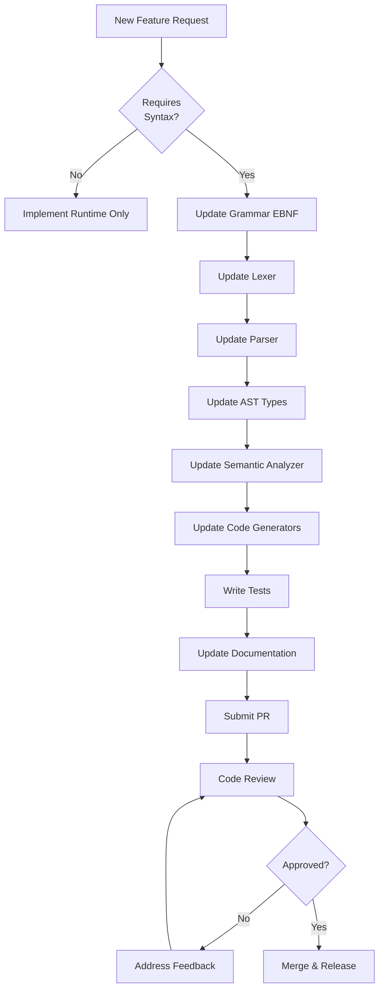

# Grammar Update Guide for PCL Contributors

> **Last Updated**: 2026-01-17  
> **Target Audience**: PCL Contributors, Language Designers, Compiler Developers

This guide explains when and how to update the PCL grammar when adding new language features.

---

## Table of Contents

1. [When to Update Grammar](#when-to-update-grammar)
2. [The 7-Step Update Process](#the-7-step-update-process)
3. [Real Examples](#real-examples)
4. [Decision Matrix](#decision-matrix)
5. [Common Pitfalls](#common-pitfalls)
6. [Testing Requirements](#testing-requirements)
7. [Best Practices](#best-practices)

---

## When to Update Grammar

### ✅ Grammar Updates ARE Required

Update the grammar when adding **syntax** that appears in `.pcl` source files:

**1. New Keywords**
```pcl
// Adding 'async' keyword
async persona ASYNC_ARCHI {
  intent: "Asynchronous architecture design"
}
```

**2. New Declaration Types**
```pcl
// Adding 'module' declarations
module myapp.auth {
  export persona AUTH_GUARD;
}
```

**3. New Operators**
```pcl
// Adding new workflow operators
ARCHI ~> SEC    // Async pipe operator
ARCHI ?? DEV    // Null-coalescing operator
```

**4. New Expressions**
```pcl
// Adding ternary expressions
result = condition ? ARCHI : SEC
```

**5. New Decorators/Annotations**
```pcl
// Adding metadata decorators
@deprecated("Use ARCHI_V2 instead")
persona ARCHI_V1 { }
```

**6. Syntax Modifications**
```pcl
// Adding optional parameters to existing constructs
team SECURITY_TEAM(priority: High) {
  members: [SEC, ARCHI]
}
```

---

### ❌ Grammar Updates NOT Required

Do **NOT** update grammar for runtime-only features:

**1. Event System (Runtime API)**
```typescript
// This is JavaScript/TypeScript, not PCL syntax
runtime.on('persona:before', (persona) => {
  console.log('Starting');
});
```

**2. Built-in Functions (Standard Library)**
```typescript
// Standard library functions (no new syntax)
const length = len(myArray);    // Uses existing function call syntax
const mapped = map(fn, list);   // Uses existing function call syntax
```

**3. Semantic Analysis (Validation)**
```typescript
// Type checking doesn't change syntax
validatePersona(node);  // Analyzes existing AST
checkCircularDependencies(team);
```

**4. Code Generation (Compilation Targets)**
```typescript
// Output format doesn't affect input syntax
generateTypeScript(ast);
generateJavaScript(ast);
generatePython(ast);
```

**5. CLI Commands (Tooling)**
```bash
# Command-line tools, not language syntax
pcl run my-app.pcl
pcl build --target typescript
```

**6. IDE Features (LSP)**
```typescript
// Language server features
provideCompletions();
provideHover();
provideDiagnostics();
```

---

## The 7-Step Update Process

### Step 1: Update EBNF Grammar

**File**: [`grammar/pcl.ebnf`](../../grammar/pcl.ebnf)

**Purpose**: Define the formal syntax specification

**Example: Adding async personas**

```ebnf
(* Before *)
persona_decl = { decorator } , { modifier } , 
               "persona" , identifier , 
               [ inheritance_clause ] , persona_body ;

(* After *)
persona_decl = { decorator } , { modifier } , 
               [ "async" ] ,              (* ← Add optional async keyword *)
               "persona" , identifier , 
               [ inheritance_clause ] , persona_body ;
```

**Best Practices**:
- Use descriptive rule names (`async_modifier` not `am`)
- Add comments explaining complex rules
- Follow existing indentation style
- Group related productions together

**Example: Adding a new operator**

```ebnf
(* Before *)
pipeline_operator = "->" | "||" | "|" ;

(* After *)
pipeline_operator = "->" | "||" | "|" | "~>" ;  (* ← Add async pipe *)
```

---

### Step 2: Update Lexer (Token Recognition)

**File**: [`src/lexer/index.ts`](../../src/lexer/index.ts)

**Purpose**: Recognize new tokens and keywords

**Example: Adding 'async' keyword**

```typescript
// Add to keyword set
const KEYWORDS = new Set([
  'persona', 'team', 'workflow', 'skill',
  'extends', 'implements', 'if', 'else',
  'async',  // ← Add new keyword
  // ...
]);
```

**Example: Adding new operator**

```typescript
// In scanToken() method
case '~':
  if (peek() === '>') {
    advance();
    addToken(TokenType.ASYNC_PIPE, '~>');  // ← Add operator token
  } else {
    addToken(TokenType.TILDE, '~');
  }
  break;
```

**Best Practices**:
- Add to `TokenType` enum: `TokenType.ASYNC_PIPE = 'ASYNC_PIPE'`
- Handle multi-character operators (lookahead)
- Preserve position information for error messages
- Add operator precedence if needed

---

### Step 3: Update Parser (AST Generation)

**File**: [`src/parser/index.ts`](../../src/parser/index.ts)

**Purpose**: Convert tokens into Abstract Syntax Tree nodes

**Example: Parsing async personas**

```typescript
function parsePersonaDeclaration(): PersonaDeclaration {
  const startPos = current().position;
  
  // Parse decorators
  const decorators = parseDecorators();
  
  // Parse optional 'async' modifier
  const isAsync = match(TokenType.ASYNC);  // ← Add async parsing
  
  // Parse 'persona' keyword
  expect(TokenType.PERSONA);
  
  // Parse persona name
  const name = expect(TokenType.IDENTIFIER).value;
  
  // Parse inheritance
  const inheritance = match(TokenType.EXTENDS) 
    ? parseInheritanceClause() 
    : undefined;
  
  // Parse body
  const body = parsePersonaBody();
  
  return {
    type: 'PersonaDeclaration',
    name,
    isAsync,           // ← Include in AST
    inheritance,
    body,
    position: { start: startPos, end: previous().position }
  };
}
```

**Example: Parsing new operator**

```typescript
function parseWorkflow(): WorkflowExpression {
  let left = parsePrimary();
  
  while (matchAny([TokenType.ARROW, TokenType.PARALLEL, TokenType.ASYNC_PIPE])) {
    const operator = previous();
    const right = parsePrimary();
    
    left = {
      type: 'BinaryExpression',
      operator: operator.value,  // '->', '||', or '~>'
      left,
      right,
      position: { start: left.position.start, end: right.position.end }
    };
  }
  
  return left;
}
```

**Best Practices**:
- Use `expect()` for required tokens, `match()` for optional
- Maintain position tracking for error messages
- Implement error recovery (synchronization points)
- Add helper functions for complex rules
- Follow existing parser patterns

---

### Step 4: Update AST Type Definitions

**File**: [`src/ast/index.ts`](../../src/ast/index.ts)

**Purpose**: Define TypeScript interfaces for new AST nodes

**Example: Adding async field to persona**

```typescript
export interface PersonaDeclaration extends ASTNode {
  type: 'PersonaDeclaration';
  name: string;
  isAsync?: boolean;        // ← Add optional field
  intent?: string;
  skills: Skill[];
  inheritance?: InheritanceClause;
  body: PersonaBody;
  decorators?: Decorator[];
  position: SourcePosition;
}
```

**Example: New workflow operator node**

```typescript
export interface AsyncPipeExpression extends ASTNode {
  type: 'AsyncPipeExpression';
  left: Expression;
  right: Expression;
  position: SourcePosition;
}

// Update union type
export type WorkflowExpression = 
  | SequentialExpression
  | ParallelExpression
  | AsyncPipeExpression      // ← Add to union
  | ConditionalExpression;
```

**Best Practices**:
- Use `readonly` for immutable fields where appropriate
- Include JSDoc comments with examples
- Follow existing naming conventions
- Add to discriminated union types
- Include position information (required for errors)

---

### Step 5: Update Semantic Analyzer

**File**: [`src/semantic/index.ts`](../../src/semantic/index.ts)

**Purpose**: Validate correct usage of new syntax

**Example: Validating async personas**

```typescript
function validatePersona(node: PersonaDeclaration): ValidationResult {
  const errors: SemanticError[] = [];
  
  // Validate async personas have required capabilities
  if (node.isAsync) {
    const hasAsyncSkill = node.skills.some(
      skill => skill.id === 'async_capable' || skill.id === 'streaming'
    );
    
    if (!hasAsyncSkill) {
      errors.push({
        message: 'Async personas must have async_capable or streaming skill',
        code: 'E0042',
        severity: 'error',
        location: node.position,
        suggestion: 'Add skill: async_capable to the persona'
      });
    }
  }
  
  // ... other validations
  
  return { ok: errors.length === 0, errors };
}
```

**Example: Validating operator usage**

```typescript
function validateAsyncPipe(node: AsyncPipeExpression): ValidationResult {
  const errors: SemanticError[] = [];
  
  // Both sides must be async-compatible
  if (!isAsyncCompatible(node.left)) {
    errors.push({
      message: 'Left side of ~> must be async-compatible',
      code: 'E0043',
      severity: 'error',
      location: node.left.position
    });
  }
  
  if (!isAsyncCompatible(node.right)) {
    errors.push({
      message: 'Right side of ~> must be async-compatible',
      code: 'E0044',
      severity: 'error',
      location: node.right.position
    });
  }
  
  return { ok: errors.length === 0, errors };
}
```

**Validation Checklist**:
- ✅ Type compatibility
- ✅ Constraint satisfaction
- ✅ Scope resolution
- ✅ Circular dependency detection
- ✅ Duplicate detection
- ✅ Required field presence
- ✅ Semantic correctness

---

### Step 6: Update Code Generators

**File**: [`src/codegen/index.ts`](../../src/codegen/index.ts)

**Purpose**: Generate target code for new syntax

**Example: TypeScript codegen for async personas**

```typescript
function generateTypeScriptPersona(node: PersonaDeclaration): string {
  const asyncKeyword = node.isAsync ? 'async ' : '';
  const name = node.name;
  
  return `
${asyncKeyword}function ${name}(query: string): Promise<string> {
  const skills = [${node.skills.map(s => `'${s.id}'`).join(', ')}];
  
  ${node.isAsync ? 
    'return await llm.streamingCall({ query, skills });' : 
    'return await llm.call({ query, skills });'
  }
}`;
}
```

**Example: JavaScript codegen for async pipe**

```typescript
function generateAsyncPipe(node: AsyncPipeExpression): string {
  const left = generate(node.left);
  const right = generate(node.right);
  
  return `
(async function() {
  const leftResult = await ${left};
  return await ${right}(leftResult);
})()`;
}
```

**Target Formats**:
- TypeScript (`typescript.ts`)
- JavaScript (`javascript.ts`)
- Python (`python.ts` - if applicable)
- JSON (`json.ts`)
- YAML (`yaml.ts`)

---

### Step 7: Update Documentation & Tests

#### A. Update Documentation

**Files to Update**:

1. **[`docs/reference/LANGUAGE.md`](../reference/LANGUAGE.md)**
   ```markdown
   ### Async Personas
   
   Personas can be declared as `async` to enable streaming responses:
   
   ```pcl
   async persona STREAMING_ARCHI {
     intent: "Real-time architecture design"
     skills: [async_capable, streaming]
   }
   ```
   
   **Requirements**:
   - Must have `async_capable` or `streaming` skill
   - Cannot be used in synchronous workflows
   ```

2. **[`grammar/pcl.ebnf`](../../grammar/pcl.ebnf)** (already done in Step 1)

3. **[`README.md`](../../README.md)** - Add to features list if significant

#### B. Add Parser Tests

**File**: `tests/parser.test.ts`

```typescript
import { describe, it, expect } from 'vitest';
import { parse } from '../src/parser';

describe('Parser - Async Personas', () => {
  it('should parse async persona declarations', () => {
    const source = `
      async persona ASYNC_ARCHI {
        intent: "Asynchronous architecture design"
        skills: [async_capable, architecture]
      }
    `;
    
    const result = parse(source);
    
    expect(result.ok).toBe(true);
    expect(result.declarations).toHaveLength(1);
    
    const persona = result.declarations[0];
    expect(persona.type).toBe('PersonaDeclaration');
    expect(persona.isAsync).toBe(true);
    expect(persona.name).toBe('ASYNC_ARCHI');
  });
  
  it('should reject async personas without async skills', () => {
    const source = `
      async persona BAD_ASYNC {
        skills: [architecture]  // Missing async_capable
      }
    `;
    
    const result = parse(source);
    
    expect(result.ok).toBe(false);
    expect(result.errors).toContainEqual(
      expect.objectContaining({
        code: 'E0042',
        message: expect.stringContaining('async_capable')
      })
    );
  });
});
```

#### C. Add Semantic Tests

**File**: `tests/semantic.test.ts`

```typescript
describe('Semantic Analysis - Async Validation', () => {
  it('should validate async skill requirements', () => {
    const ast = parse('async persona X { skills: [architecture] }');
    const result = analyze(ast);
    
    expect(result.errors).toHaveLength(1);
    expect(result.errors[0].code).toBe('E0042');
  });
});
```

#### D. Add Integration Tests

**File**: `tests/integration.test.ts`

```typescript
describe('Integration - Async Personas', () => {
  it('should compile and execute async personas', async () => {
    const source = `
      async persona STREAMING_ARCHI {
        intent: "Real-time design"
        skills: [async_capable, architecture]
      }
    `;
    
    const compiled = compile(source);
    const result = await runtime.execute('STREAMING_ARCHI', 'Design a system');
    
    expect(result.streaming).toBe(true);
    expect(result.response).toBeDefined();
  });
});
```

**Test Coverage Requirements**:
- ✅ **Parsing**: Valid syntax accepted
- ✅ **Error Handling**: Invalid syntax rejected with helpful messages
- ✅ **Semantic Validation**: Type errors caught
- ✅ **Code Generation**: Correct output produced
- ✅ **Integration**: End-to-end functionality works

---

## Real Examples

### Example 1: Lifecycle Hooks (Actual PCL Feature)

**Problem**: Need to execute code at specific lifecycle points

**Solution**: Add decorator-style hooks to personas

#### Step 1: Grammar

```ebnf
(* grammar/pcl.ebnf lines 244-248 *)
hook_decl  = "@" , hook_name , [ "(" , [ parameters ] , ")" ] , block ;
hook_name  = "onActivate" | "onDeactivate" | "onError" | "onMessage"
           | "onStep" | "onComplete" | "beforeMerge" | "afterMerge"
           | "onSpawn" | "onDespawn" | "onTimeout" | "onRetry" ;
```

#### Step 2: Lexer

```typescript
// No new tokens needed - uses existing @ symbol and identifiers
```

#### Step 3: Parser

```typescript
function parseHook(): HookDeclaration {
  expect(TokenType.AT);
  const hookName = expect(TokenType.IDENTIFIER).value;
  
  // Validate hook name
  const validHooks = ['onActivate', 'onDeactivate', 'onError', /* ... */];
  if (!validHooks.includes(hookName)) {
    throw error(`Unknown hook: @${hookName}`);
  }
  
  // Parse optional parameters
  const params = match(TokenType.LPAREN) 
    ? parseParameters() 
    : [];
  
  // Parse block
  const block = parseBlock();
  
  return {
    type: 'HookDeclaration',
    hookName,
    parameters: params,
    block,
    position: { /* ... */ }
  };
}
```

#### Step 4: AST

```typescript
export interface HookDeclaration extends ASTNode {
  type: 'HookDeclaration';
  hookName: string;
  parameters: Parameter[];
  block: BlockStatement;
  position: SourcePosition;
}
```

#### Step 5: Semantic Analysis

```typescript
function validateHook(node: HookDeclaration): ValidationResult {
  // Validate parameters match hook signature
  if (node.hookName === 'onError' && node.parameters.length !== 1) {
    return error('onError hook requires exactly 1 parameter (error)');
  }
  
  // Validate block doesn't violate constraints
  // ...
}
```

#### Step 6: Codegen

```typescript
function generateHook(node: HookDeclaration): string {
  return `
runtime.on('persona:${camelToSnake(node.hookName)}', (${node.parameters.join(', ')}) => {
  ${generate(node.block)}
});`;
}
```

#### Step 7: Documentation

- Added to [`docs/reference/LANGUAGE.md`](../reference/LANGUAGE.md) Section 6: Lifecycle Hooks
- Examples in [`examples/showcase.pcl`](../../examples/showcase.pcl)
- Tests in `tests/integration.test.ts`

---

### Example 2: Team Declarations (Actual PCL Feature)

**Problem**: Need to compose multiple personas into teams

**Solution**: Add `team` keyword and member syntax

#### Step 1: Grammar

```ebnf
team_decl = { decorator } , { modifier } , "team" , identifier ,
            [ type_parameters ] , team_body ;

team_body = "{" , 
            [ members_clause ] ,
            [ primary_clause ] ,
            [ merge_clause ] ,
            [ quorum_clause ] ,
            [ conflict_clause ] ,
            "}" ;

members_clause = "members" , ":" , "[" , persona_list , "]" ;
```

#### Remaining Steps

Follow same pattern as lifecycle hooks example:
- Lexer: Add `team` keyword
- Parser: Implement `parseTeamDeclaration()`
- AST: Define `TeamDeclaration` interface
- Semantic: Validate members exist, no duplicates, primary in members
- Codegen: Generate team coordination code
- Docs: Update LANGUAGE.md
- Tests: Parser, semantic, integration tests

**See**: [`docs/api/PARSER.md`](../api/PARSER.md) for complete team parsing details

---

## Decision Matrix

| Feature | Grammar Update? | Why |
|---------|----------------|-----|
| **Lifecycle Hooks** (`@onActivate`) | ✅ Yes | PCL decorator syntax in `.pcl` files |
| **Event System** (`runtime.on()`) | ❌ No | JavaScript API, not PCL syntax |
| **Team Declarations** | ✅ Yes | New `team` keyword and syntax |
| **Workflow Operators** (`->`, `\|\|`) | ✅ Yes | New operators in expressions |
| **Built-in Functions** (`len()`, `map()`) | ❌ No | Standard library (uses existing function syntax) |
| **Type Checking** | ❌ No | Semantic analysis of existing syntax |
| **Code Generation** | ❌ No | Output format, not input syntax |
| **CLI Commands** | ❌ No | Tooling, not language |
| **LSP Features** | ❌ No | IDE support, not language |
| **New Keywords** (`async`, `await`) | ✅ Yes | Language-level syntax change |
| **Template Strings** | ✅ Yes | New literal syntax |
| **Pattern Matching** | ✅ Yes | New expression syntax |
| **Macros** | ✅ Yes | New preprocessing syntax |

**Golden Rule**: If it's written in a `.pcl` file, it needs grammar updates. If it's only in JavaScript/TypeScript runtime, it doesn't.

---

## Common Pitfalls

### ❌ Pitfall 1: Forgetting Position Tracking

```typescript
// BAD - No position information
return {
  type: 'PersonaDeclaration',
  name: name
};

// GOOD - Include position for error messages
return {
  type: 'PersonaDeclaration',
  name: name,
  position: {
    start: startToken.position,
    end: currentToken.position
  }
};
```

### ❌ Pitfall 2: Incomplete Error Recovery

```typescript
// BAD - Parser crashes on error
function parsePersona() {
  expect(TokenType.PERSONA);
  // If this fails, parser stops
}

// GOOD - Synchronize and continue
function parsePersona() {
  try {
    expect(TokenType.PERSONA);
  } catch (e) {
    errors.push(e);
    synchronize(); // Skip to next declaration
    return null;
  }
}
```

### ❌ Pitfall 3: Not Updating All Code Generators

```typescript
// BAD - Only updated TypeScript generator
function generateTypeScript(node: AsyncPersona) {
  return `async function ${node.name}() { }`;
}

// GOOD - Update ALL generators
function generateTypeScript(node: AsyncPersona) { /* ... */ }
function generateJavaScript(node: AsyncPersona) { /* ... */ }
function generatePython(node: AsyncPersona) { /* ... */ }
function generateJSON(node: AsyncPersona) { /* ... */ }
```

### ❌ Pitfall 4: Weak Semantic Validation

```typescript
// BAD - Shallow validation
function validate(node: Persona) {
  if (!node.name) throw error('Missing name');
}

// GOOD - Comprehensive validation
function validate(node: Persona) {
  // Name validation
  if (!node.name) throw error('Missing name');
  if (!/^[A-Z][A-Z0-9_]*$/.test(node.name)) {
    throw error('Invalid name format');
  }
  
  // Skill validation
  for (const skill of node.skills) {
    if (!isValidSkill(skill)) {
      throw error(`Unknown skill: ${skill}`);
    }
  }
  
  // Circular dependency check
  if (hasCircularDependency(node)) {
    throw error('Circular dependency detected');
  }
}
```

### ❌ Pitfall 5: Missing Test Coverage

```typescript
// BAD - Only test happy path
it('should parse async personas', () => {
  const result = parse('async persona X { }');
  expect(result.ok).toBe(true);
});

// GOOD - Test edge cases and errors
describe('Async Personas', () => {
  it('should parse valid async personas', () => { /* ... */ });
  it('should reject async without skills', () => { /* ... */ });
  it('should reject async in sync workflows', () => { /* ... */ });
  it('should handle missing braces', () => { /* ... */ });
  it('should provide helpful error messages', () => { /* ... */ });
});
```

---

## Testing Requirements

### Minimum Coverage

| Component | Coverage Target | Test Types |
|-----------|----------------|------------|
| **Lexer** | 100% | Token recognition, error cases |
| **Parser** | 100% | Valid syntax, invalid syntax, error recovery |
| **Semantic Analyzer** | 95% | Validation rules, edge cases |
| **Code Generators** | 90% | Output correctness for each target |
| **Integration** | 80% | End-to-end scenarios |

### Test Checklist

**Parser Tests**:
- ✅ Valid syntax accepted
- ✅ Invalid syntax rejected
- ✅ Error messages helpful and accurate
- ✅ Position information correct
- ✅ Edge cases handled (empty, whitespace, comments)

**Semantic Tests**:
- ✅ Type errors caught
- ✅ Constraint violations detected
- ✅ Scope resolution correct
- ✅ Circular dependencies detected
- ✅ Duplicate definitions rejected

**Codegen Tests**:
- ✅ Generated code syntactically valid
- ✅ Generated code semantically equivalent
- ✅ All targets updated
- ✅ Edge cases produce correct output

**Integration Tests**:
- ✅ Parse → Analyze → Generate → Execute
- ✅ Real-world examples work
- ✅ Performance acceptable

---

## Best Practices

### ✅ DO

**1. Start with the Grammar**
- Update `grammar/pcl.ebnf` first
- Write clear, unambiguous rules
- Add comments explaining complex cases

**2. Follow Existing Patterns**
- Study similar features (e.g., lifecycle hooks for decorators)
- Use consistent naming (declarations, expressions, statements)
- Match existing code style

**3. Provide Excellent Error Messages**
```typescript
// GOOD
throw error(
  `Async personas must have 'async_capable' skill.\n` +
  `Add: skills: [async_capable, ...] to ${node.name}`,
  node.position
);

// BAD
throw error('Invalid persona');
```

**4. Write Comprehensive Tests**
- Test happy path AND edge cases
- Test error messages are helpful
- Test all code generation targets

**5. Document Everything**
- Update LANGUAGE.md with syntax and examples
- Add JSDoc to AST interfaces
- Write migration guides for breaking changes

**6. Consider Backward Compatibility**
- Make new syntax optional when possible
- Provide deprecation warnings
- Document breaking changes clearly

**7. Validate Early and Often**
- Validate in parser (syntax errors)
- Validate in semantic analyzer (type errors)
- Validate in codegen (unsupported features)

---

### ❌ DON'T

**1. Skip Steps**
- Don't skip semantic validation
- Don't forget to update ALL code generators
- Don't skip documentation

**2. Break Existing Code**
- Don't change existing syntax without migration path
- Don't remove features without deprecation
- Don't break backward compatibility in minor versions

**3. Ignore Error Cases**
- Don't assume input is valid
- Don't let parser crash on bad input
- Don't provide cryptic error messages

**4. Forget Position Information**
- Don't create AST nodes without position
- Don't lose line/column info in transformations
- Don't make errors untraceable

**5. Add Ambiguous Syntax**
- Don't create parsing conflicts
- Don't use same syntax for different features
- Don't make precedence unclear

---

## Workflow Summary



---

## Quick Reference

### Files to Modify

| Step | File(s) | Purpose |
|------|---------|---------|
| 1 | `grammar/pcl.ebnf` | Formal grammar specification |
| 2 | `src/lexer/index.ts` | Token recognition |
| 3 | `src/parser/index.ts` | AST generation |
| 4 | `src/ast/index.ts` | AST type definitions |
| 5 | `src/semantic/index.ts` | Validation rules |
| 6 | `src/codegen/*.ts` | Code generation (all targets) |
| 7a | `docs/reference/LANGUAGE.md` | Language reference |
| 7b | `tests/*.test.ts` | Tests (parser, semantic, integration) |

### Commands

```bash
# Run parser tests
npm run test -- parser.test.ts

# Run semantic tests
npm run test -- semantic.test.ts

# Run all tests
npm test

# Check test coverage
npm run test:coverage

# Build compiler
npm run build

# Type check
npm run typecheck

# Lint code
npm run lint

# Format code
npm run format
```

---

## See Also

- [PCL Language Reference](../reference/LANGUAGE.md)
- [Parser API Documentation](../api/PARSER.md)
- [Code Generation Guide](../api/CODEGEN.md)
- [Semantic Analysis Guide](../api/SEMANTIC.md)
- [EBNF Grammar Specification](../../grammar/pcl.ebnf)

---

## Questions?

- Open an issue: [GitHub Issues](https://github.com/pcl-lang/pcl/issues)
- Join Discord: PCL Community Server
- Read RFCs: `.roadmap/rfcs/` directory

---

**Remember**: Grammar updates are about adding **syntax** to `.pcl` files. If users don't write it in PCL source code, you probably don't need to update the grammar.
